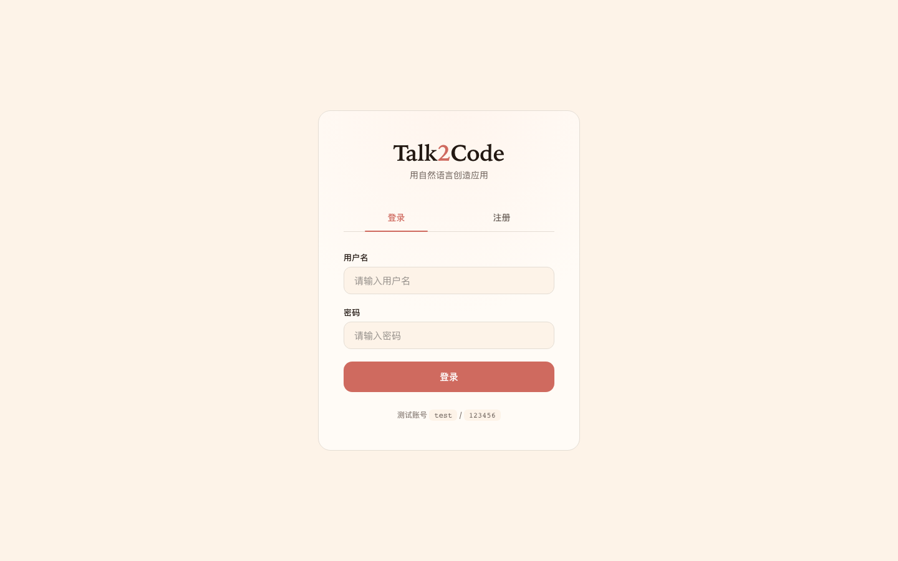
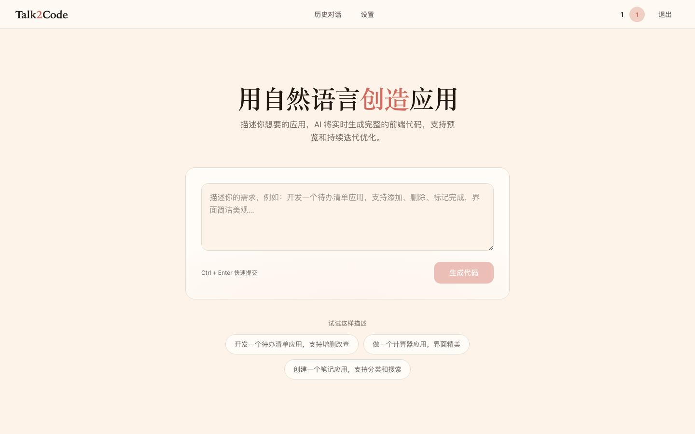
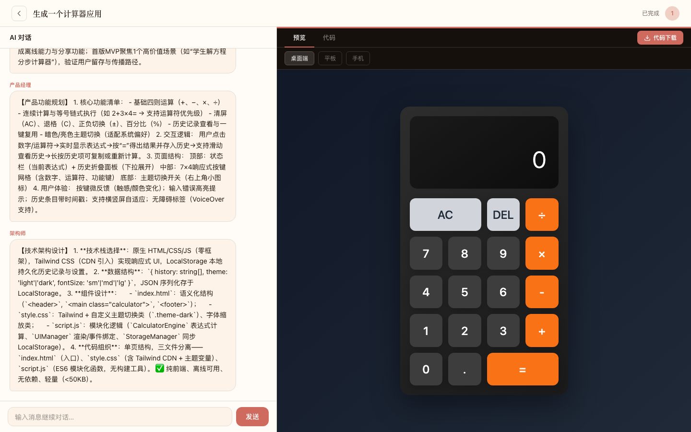
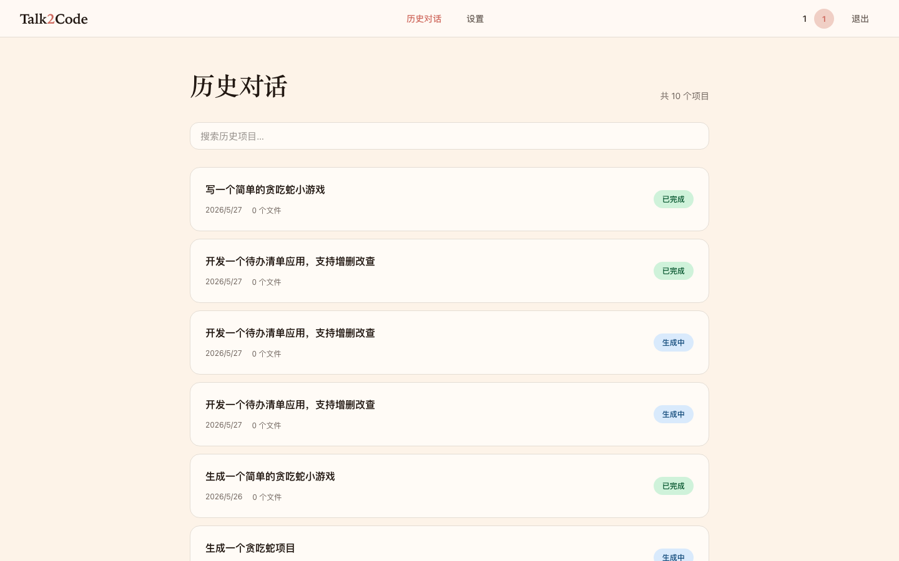
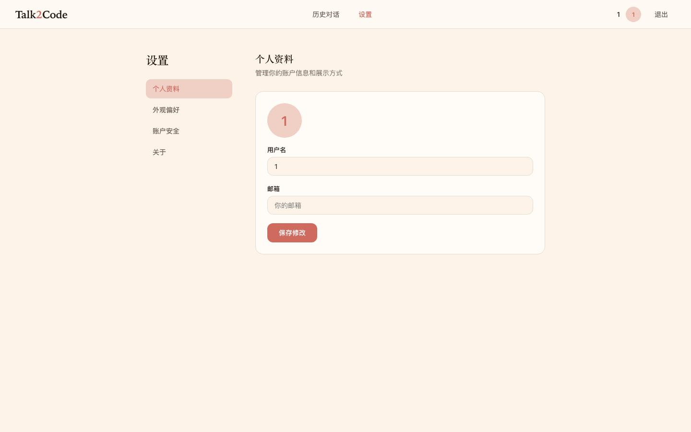

# Talk2Code

一个 AI 驱动的代码生成平台，用户输入自然语言需求 → AI 多智能体协同处理 → 实时生成可运行的产品代码。

## 技术栈

- **前端**: HTML5 + CSS3 + JavaScript + Warm Soft 设计系统 (OKLch)
- **后端**: Python 3.11+ + Flask
- **数据库**: SQLite
- **实时通信**: SSE (Server-Sent Events)
- **认证**: JWT
- **AI 编排**: LangGraph + LangChain
- **AI 模型**: 兼容 OpenAI/Anthropic 接口协议，配置驱动切换

## 项目结构

```
talk2code/
├── backend/
│   ├── app.py              # Flask 主程序（API、SSE 推送）
│   ├── config.py           # Pydantic 配置（数据库、JWT、SSE、LLM）
│   ├── models.py           # 数据库模型（User, Requirement）
│   ├── prompts.py          # 智能体提示词模板
│   ├── requirements.txt    # Python 依赖
│   ├── .env.example        # LLM 配置模板
│   ├── llm/
│   │   └── client.py       # 统一 LLM 客户端（支持 OpenAI/Anthropic 双协议）
│   ├── agents/
│   │   ├── state.py        # LangGraph AgentState 定义
│   │   ├── nodes.py        # 智能体节点（Planner / Coder）
│   │   └── workflow.py     # LangGraph 工作流定义
│   ├── services/
│   │   ├── requirement_service.py  # 需求处理服务
│   │   ├── sse_manager.py          # SSE 管理器
│   │   └── task_queue.py           # 任务队列
│   ├── craft/              # 设计质量规则（anti-slop/accessibility/typography/color）
│   ├── craft_loader.py     # Craft 规则加载器
│   ├── skills/             # 可插拔应用模板（todo/calculator/note/calendar/generic）
│   ├── skill_loader.py     # Skill 匹配引擎
│   ├── utils/
│   │   ├── logger.py       # 日志工具
│   │   ├── security.py     # 密码加密
│   │   ├── sse.py          # SSE 消息格式化
│   │   ├── retry.py        # 指数退避重试
│   │   └── rate_limiter.py # 限流器
│   └── tests/              # 测试
├── frontend/
│   ├── login.html          # 登录/注册页
│   ├── index.html          # 首页 — 需求输入
│   ├── detail.html         # 需求详情页（AI 对话 + 代码编辑器 + 预览）
│   ├── history.html        # 历史对话 — 项目列表
│   ├── settings.html       # 设置 — 个人资料/外观/账户/关于
│   └── js/
│       └── security.js     # XSS 防护工具
└── openspec/               # OpenSpec 规范驱动开发
```

## 快速开始

### 1. 安装依赖

```bash
python -m venv venv
source venv/bin/activate
pip install -r backend/requirements.txt
```

### 2. 配置 LLM

复制配置模板并填入你的 API Key：

```bash
cp backend/.env.example backend/.env
# 编辑 backend/.env，填入 LLM_API_KEY
```

支持两种协议，通过 `LLM_PROVIDER` 切换：

| 协议 | 适用服务商 |
|------|-----------|
| `openai_compatible` | DeepSeek、DashScope、OpenAI、智谱、月之暗面 等 |
| `anthropic_compatible` | Anthropic Claude 等 |

```bash
# OpenAI 兼容示例（DeepSeek）
LLM_PROVIDER=openai_compatible
LLM_BASE_URL=https://api.deepseek.com
LLM_MODEL=deepseek-v4-flash
LLM_API_KEY=your-api-key-here
```

### 3. 启动服务

```bash
cd backend && python app.py
```

访问 http://localhost:5001/login.html

### 4. 测试账号

- 用户名：`test`
- 密码：`123456`

## 使用流程

1. **登录** - 使用测试账号或注册新账号
2. **输入需求** - 在首页输入框描述你的需求
   - 示例：`开发一个待办清单 App，支持增删改查`
   - 示例：`做一个计算器应用`
   - 示例：`创建一个笔记应用`
3. **需求澄清**（自动触发）- 需求不明确时 AI 生成问题表单补充信息
4. **查看生成** - 进入详情页：
   - **左侧**: 观看 AI 智能体（Planner → Coder）协同讨论
   - **右侧**: 实时查看代码生成（支持代码/预览 TAB 切换、桌面/平板/手机设备预览）
5. **持续对话** - 生成完成后，可在左侧 AI 对话面板底部继续与 AI 对话
6. **历史管理** - 在「历史对话」页面查看所有项目，支持搜索和状态筛选

## 核心功能

### 用户系统
- 用户注册/登录（JWT 认证）
- 登录状态持久化
- 未登录拦截

### AI 智能体协同

基于 **LangGraph** 实现的工作流编排，2 个智能体按顺序协同：

```
┌──────────────┐     ┌──────────────┐
│   Planner    │────▶│    Coder     │
│  需求分析    │     │  代码生成    │
│  架构设计    │     │              │
└──────────────┘     └──────────────┘
```

- **Planner**: 分析需求，产出结构化的开发计划（功能清单、技术栈、数据模型、文件结构）；模糊需求时自动生成澄清问题
- **Coder**: 根据 Plan 生成完整的代码文件（HTML/CSS/JS），注入 Craft 设计质量规则，支持失败自动重试和 Fallback 模板

### 设计质量规则（Craft 层）

系统在代码生成时自动注入设计质量约束：

- **anti-ai-slop**: 避免 AI 刻板模式（默认 indigo 色系、emoji 图标、圆角卡片+彩色左边框等）
- **accessibility-baseline**: 颜色对比度、键盘导航、语义化 HTML、ARIA 标签
- **typography**: 字号层级、行高、字距、行宽、字体配对
- **color**: 色板结构、主色纪律、语义色、暗色主题

### 可插拔应用模板（Skill 系统）

通过 `skills/` 目录下的 Markdown 文件定义应用类型，支持关键词自动匹配：

- 待办清单、计算器、笔记、日历、通用应用
- 新增应用类型只需添加 `skills/<name>/SKILL.md`，无需修改代码

### 交互式需求澄清

- 需求过短或缺少功能关键词时，AI 自动生成结构化问题表单
- 用户补充后重新进入生成流程，最多 1 轮澄清

### 代码编辑器
- 自建代码编辑器（文件树侧边栏 + 内容预览 + contenteditable 编辑）
- 多文件切换（HTML/CSS/JS）
- 实时预览（iframe 沙箱隔离 + CSP + device preview）
- 代码下载功能

### 数据持久化
- SQLite 存储用户数据
- 对话历史完整保存
- 代码文件完整保存

## API 接口

| 接口 | 方法 | 说明 |
|------|------|------|
| /api/register | POST | 用户注册 |
| /api/login | POST | 用户登录 |
| /api/requirements | POST | 创建需求 |
| /api/requirements | GET | 获取需求列表 |
| /api/requirements/<id> | GET | 获取需求详情 |
| /api/requirements/<id>/chat | POST | 发送对话消息（持续对话） |
| /api/requirements/<id>/clarify | POST | 提交澄清答案（交互式澄清） |
| /api/requirements/<id>/code | POST | 保存代码修改 |
| /api/sse/<id> | GET | SSE 实时推送连接 |
| /api/health | GET | 健康检查（含 LLM 配置状态） |

## 支持的应用类型

- **待办清单 App** (输入包含"待办"、"todo"或"清单")
- **计算器 App** (输入包含"计算器"或"计算")
- **笔记 App** (输入包含"笔记"或"备忘录")
- **日历 App** (输入包含"日历"、"日程"或"calendar")
- **通用应用** (其他需求 — AI 自主设计)

## 界面预览

### 登录页面


### 首页


### 需求详情页（代码视图）


### 需求详情页（预览视图）


### 历史对话


### 设置


---

**页面说明**:
- **登录页**: Warm Soft 暖色设计，登录/注册双 Tab 切换，测试账号提示
- **首页**: Hero 衬线标题 + 需求输入卡片（径向渐变装饰）+ 示例快捷填充，毛玻璃导航栏
- **详情页**: 左侧气泡式 AI 对话 + 右侧暗色代码面板（文件树+编辑器），代码/预览 TAB 切换
- **历史对话**: 项目列表 + 实时搜索 + 彩色状态徽章（已完成/生成中/排队中/失败）
- **设置**: 侧边栏布局，个人资料/外观偏好/账户安全/关于 四个分区

## 注意事项

1. 这是一个 Demo 项目，AI 智能体使用预设的 prompt 模板
2. 需要在 `.env` 中配置 `LLM_API_KEY` 才能使用 AI 功能
3. 生产环境请配置 `JWT_SECRET_KEY`、`LLM_API_KEY` 等敏感信息
4. 建议使用现代浏览器（Chrome/Edge/Safari）
5. LangGraph 工作流支持错误降级和 fallback 机制
